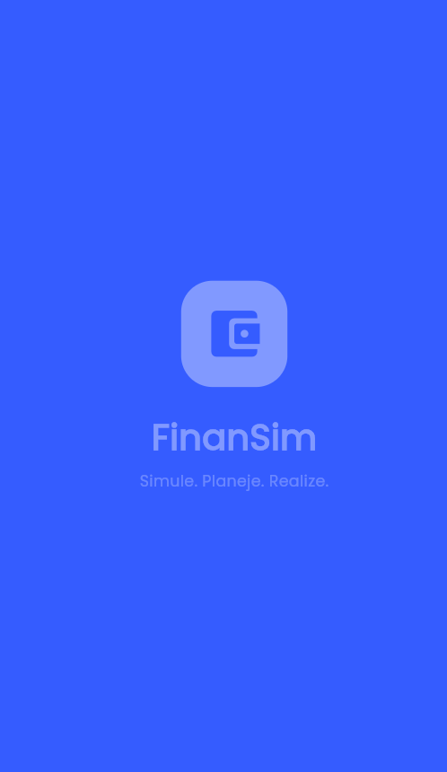
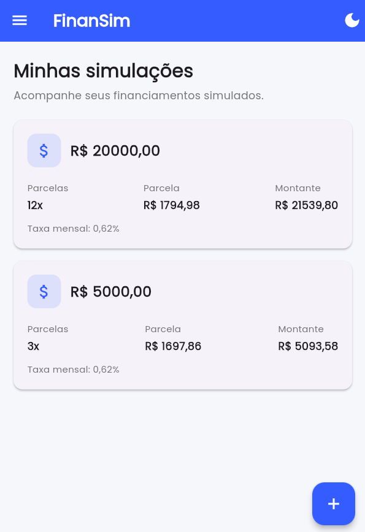
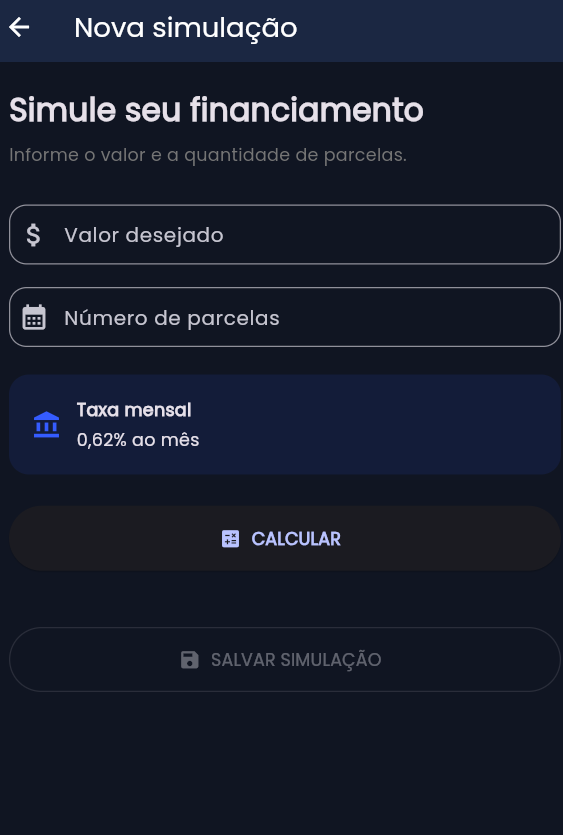
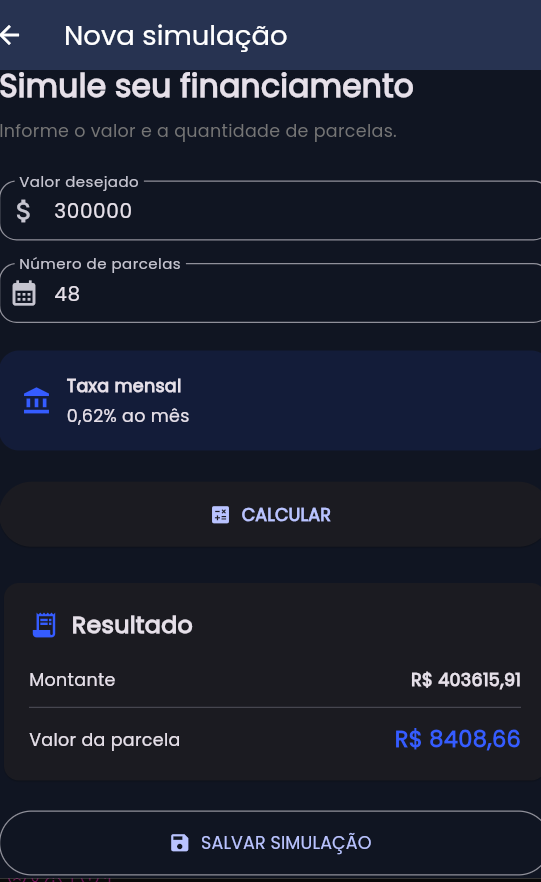

# 💰 Simulador Financeiro

Aplicação mobile desenvolvida em **Flutter** para realizar simulações financeiras de forma simples, rápida e intuitiva, utilizando dados e serviços disponibilizados pelo **Banco Central do Brasil**.

Projeto desenvolvido como parte de um desafio acadêmico de desenvolvimento mobile.

---

## 📱 Sobre o projeto

O **Simulador Financeiro** foi desenvolvido para permitir que o usuário realize simulações de maneira prática, preenchendo as informações necessárias e visualizando os resultados de forma clara e organizada.

A aplicação foi pensada para oferecer uma experiência:

* ✨ Intuitiva
* 📊 Organizada
* 📱 Responsiva
* 💡 Fácil de utilizar
* 🎨 Visualmente agradável

Os wireframes disponibilizados no desafio foram utilizados como referência para a construção das telas, permitindo adaptações na disposição dos elementos.

---

## 🚀 Tecnologias utilizadas

* **Flutter**
* **Dart**
* **API do Banco Central do Brasil**
* **HTTP** para comunicação com a API
* **Material Design**

---

## 🌐 API

O projeto utiliza informações disponibilizadas pelo **Banco Central do Brasil**.

🔗 [Banco Central do Brasil](https://www.bcb.gov.br/)

A integração com a API permite que a aplicação trabalhe com dados financeiros obtidos de uma fonte externa.

---

## 📸 Screenshots

Abaixo estão alguns registros das telas desenvolvidas no aplicativo.

### 🏠 Tela inicial

<!-- Coloque aqui o print da tela inicial -->

<p align="center">
  
</p>

---

### 🏠 Tela Home

<!-- Coloque aqui o print da tela inicial -->

<p align="center">
  
</p>

---
### 💰 Cadastro de simulação

<!-- Coloque aqui o print da tela de simulação -->

<p align="center">
  
</p>

---

### 📊 Tela de completa de cadastro

<!-- Coloque aqui o print da tela de resultado -->

<p align="center">
  
</p>

---


## ⚙️ Como executar o projeto

### 1. Pré-requisitos

É necessário ter instalado:

* Flutter
* Dart
* Android Studio ou outro ambiente compatível
* Emulador Android ou dispositivo físico

Para verificar a instalação:

```bash
flutter doctor
```

### 2. Clonar o projeto

```bash
git clone https://github.com/MIRELLA-02/FinanSim.git
```

Depois, entre na pasta do projeto:

```bash
cd nome-do-projeto
```

### 3. Instalar as dependências

```bash
flutter pub get
```

### 4. Executar

```bash
flutter run
```

---

## 🧮 Funcionamento

O funcionamento principal da aplicação segue o fluxo:

**1.** O usuário acessa a tela inicial.

**2.** Preenche os dados necessários para realizar a simulação.

**3.** A aplicação realiza a consulta das informações necessárias através da API.

**4.** Os dados recebidos são processados.

**5.** O resultado da simulação é apresentado ao usuário.

---

## 🎨 Interface

A interface foi desenvolvida buscando proporcionar uma experiência simples e intuitiva.

Foram utilizados elementos como:

* Campos de entrada;
* Botões de ação;
* Cards;
* Resultados organizados;
* Navegação entre telas;
* Elementos visuais para facilitar a compreensão das informações.

A disposição dos elementos foi adaptada a partir dos wireframes fornecidos no desafio.

---

## 📌 Objetivos do projeto

O desenvolvimento teve como principais objetivos:

* Praticar o desenvolvimento de aplicativos com Flutter;
* Consumir uma API externa;
* Trabalhar com requisições HTTP;
* Manipular dados recebidos de uma API;
* Desenvolver uma interface intuitiva;
* Aplicar conceitos de desenvolvimento mobile;
* Transformar uma proposta de wireframe em uma aplicação funcional.

---

## 👩‍💻 Desenvolvimento por

Projeto desenvolvido por Mirella Brolezi, durante o curso de **Desenvolvimento de Sistemas**.

### 🛠️ Tecnologias

| Tecnologia      | Utilização                    |
| --------------- | ----------------------------- |
| Flutter         | Desenvolvimento do aplicativo |
| Dart            | Linguagem de programação      |
| Banco Central   | Fonte dos dados               |
| HTTP            | Comunicação com a API         |
| Material Design | Construção da interface       |


